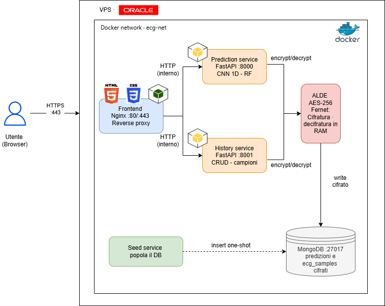
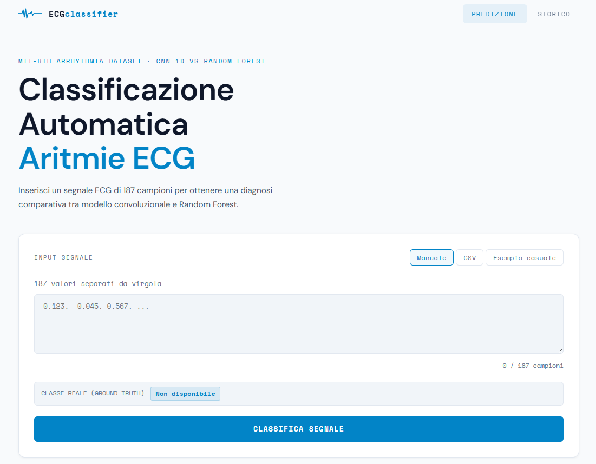
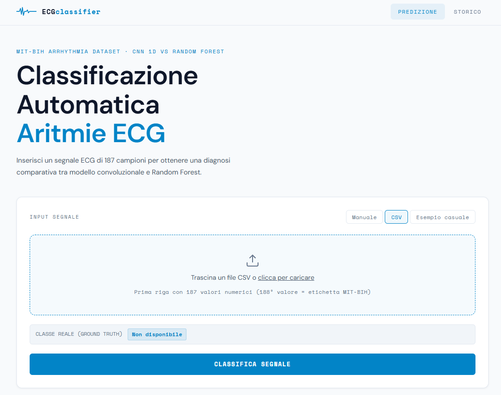
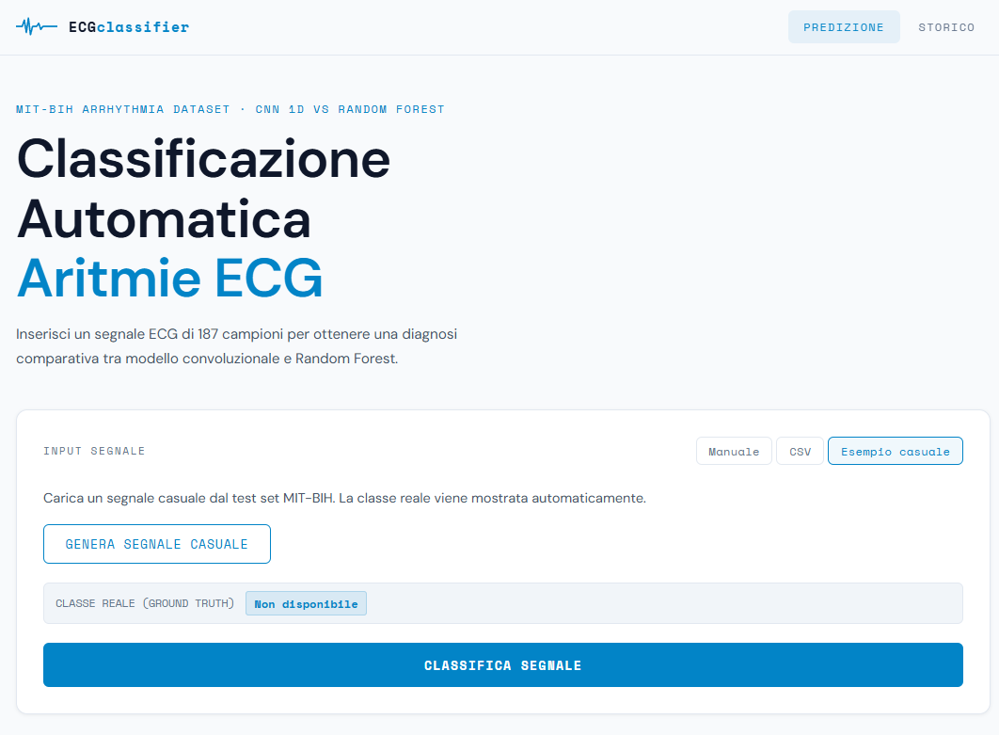
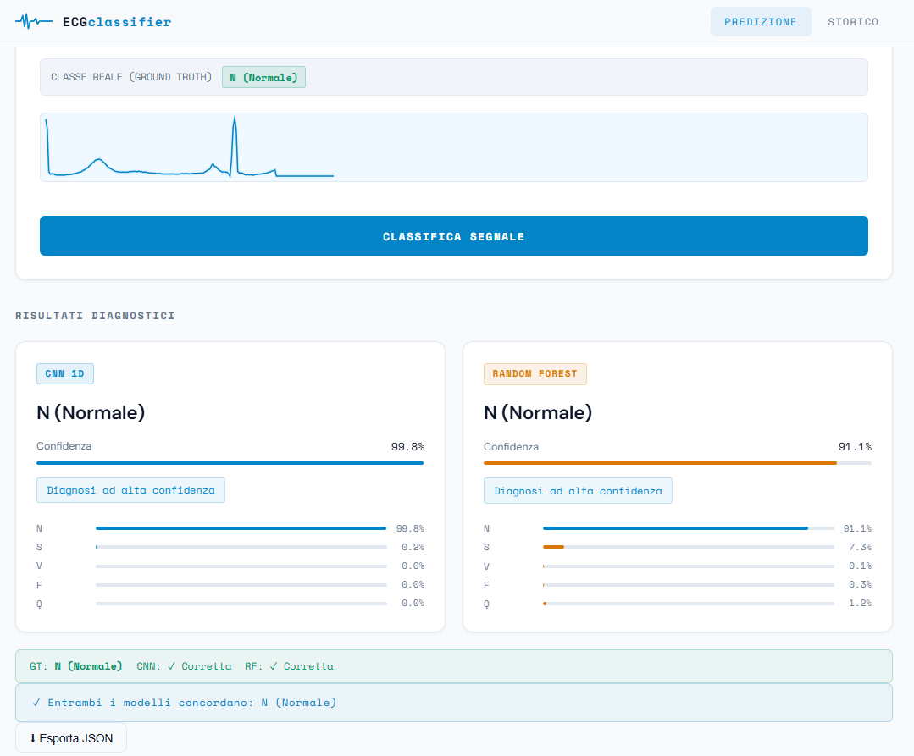
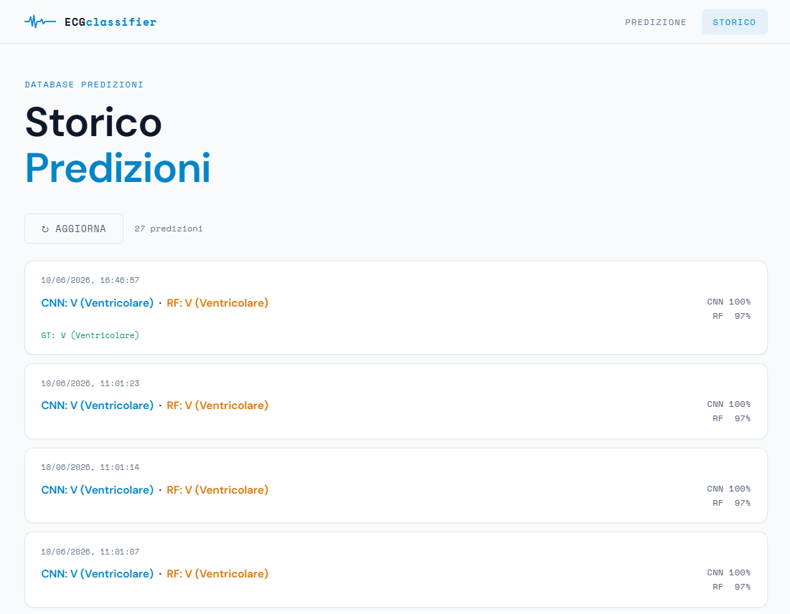

# ECG Arrhythmia Classifier


> **Classificazione Automatica delle Aritmie ECG-**
> *Sistema diagnostico comparativo CNN 1D vs Random Forest su segnali elettrocardiografici, evoluzione dell'interfaccia Gradio sviluppata precedentemente — Università degli Studi di Bari "Aldo Moro", A.A. 2025/2026.*

      

---

## Indice

- [1. Visione del Progetto e Origine](#1-visione-del-progetto-e-origine)
- [2. Evoluzione Architetturale: da Gradio a Microservizi](#2-evoluzione-architetturale-da-gradio-a-microservizi)
- [3. Architettura del Sistema e Sicurezza (ALDE)](#3-architettura-del-sistema-e-sicurezza-alde)
- [4. Stack Tecnologico](#4-stack-tecnologico)
- [5. Struttura del Progetto](#5-struttura-del-progetto)
- [6. I Modelli di Classificazione](#6-i-modelli-di-classificazione)
- [7. API Reference](#7-api-reference)
- [8. Frontend: Interfaccia Web](#8-frontend-interfaccia-web)
- [9. Guida all'Installazione](#9-guida-allinstallazione)
  - [9.1 Passaggio Preliminare: Download dei modelli](#91-passaggio-preliminare-download-dei-modelli)
  - [9.2 Scelta del Percorso di Esecuzione](#92-scelta-del-percorso-di-esecuzione)
  - [9.3 Passaggio Finale: Seed del dataset MIT-BIH](#93-passaggio-finale-seed-del-dataset-mit-bih)
  - [9.4 Verifica dello stato dei servizi](#94-verifica-dello-stato-dei-servizi)
- [10. Variabili d'Ambiente](#10-variabili-dambiente)
- [11. Verifica Sicurezza Database (Cifratura ALDE)](#11-verifica-sicurezza-database-cifratura-alde)
- [12. Risoluzione Problemi (Troubleshooting)](#12-risoluzione-problemi-troubleshooting)
- [13. Riferimenti Scientifici](#13-riferimenti-scientifici)

---

## 1. Visione del Progetto e Origine

**ECG Arrhythmia Classifier** è un sistema web di supporto diagnostico per la classificazione automatica delle aritmie cardiache a partire da segnali ECG del dataset standard **MIT-BIH Arrhythmia Database** (87.554 campioni, 5 classi, 360 Hz).

### Contesto Clinico e Motivazione
Le patologie cardiovascolari rappresentano una delle principali cause di mortalità e ospedalizzazione a livello globale, rendendo lo screening tempestivo e il monitoraggio continuo strumenti imprescindibili per la prevenzione clinica. 
In questo contesto, l'elettrocardiogramma (ECG) si configura come l'esame diagnostico non invasivo fondamentale per l'identificazione delle aritmie cardiache. 
Tuttavia, l'analisi manuale di tracciati ECG a lungo termine richiede tempi prolungati e un'elevata competenza specialistica, introducendo il rischio di sviste dettate dal carico di lavoro del personale medico.
L'introduzione di sistemi di elaborazione digitale e di algoritmi di classificazione automatica risponde alla necessità clinica di disporre di strumenti di supporto decisionale rapidi, affidabili e operanti in tempo reale.

### Il Problema dello Sbilanciamento delle Classi
Il dataset MIT-BIH Arrhythmia costituisce lo standard di riferimento assoluto per l'addestramento e la validazione di tali modelli computazionali. 
Nonostante ciò, l'analisi predittiva in scenari reali è ostacolata da un evidente sbilanciamento delle classi. 
All'interno dei dataset clinici, la classe dei battiti normali risulta dominante rispetto alle minoranze patologiche, quali i battiti ectopici ventricolari o di fusione. 
La parola "ectopico" deriva dal greco *ek* e *topos* (letteralmente "fuori posto"); infatti, un battito ectopico è una contrazione del cuore che ha origine in una zona anomala, fuori dal suo pacemaker naturale. 

I modelli tradizionali tendono a massimizzare l'accuratezza globale, ignorando le minoranze patologiche. Ciò si traduce in un inaccettabile tasso di falsi negativi sulle aritmie critiche, compromettendo gravemente la sicurezza diagnostica del paziente.

### Paradigmi a Confronto

Dal punto di vista dell'Ingegneria del Software, questo sistema è concepito come un prodotto software in contrapposizione a un progetto su commissione: non esiste un cliente esterno che genera requisiti, ma un'esigenza reale nel dominio clinico che guida le scelte di sviluppo. La product vision risponde alle tre domande fondamentali: cosa (classificatore ECG automatico), chi (operatori sanitari e ricercatori), perché (ridurre i falsi negativi sulle aritmie critiche rispetto all'analisi manuale).


Il progetto affronta la problematica descritta mettendo a confronto due paradigmi opposti di machine learning:

- **Random Forest (RF):** approccio classico basato su feature engineering manuale (9 descrittori morfologici). Offre un'elevata trasparenza morfologica, ma richiede una complessa fase di estrazione manuale delle caratteristiche che spesso non riesce a catturare la dinamica non lineare del segnale grezzo, penalizzando le performance complessive.
- **CNN 1D:** architettura deep learning end-to-end su 3 blocchi convoluzionali (~204K parametri). Garantisce un'estrazione autonoma dei pattern locali direttamente dal segnale grezzo ed elevatissime prestazioni statistiche, abbattendo drasticamente i falsi negativi sulle aritmie critiche.

La metrica primaria adottata è la **macro Recall**, clinicamente più rilevante dell'accuracy globale in contesti di forte sbilanciamento delle classi, poiché misura la frazione di battiti patologici reali correttamente identificati dal modello.

| Modello | Accuracy | Macro Recall | Macro F1 | AUC |
|:---:|:---:|:---:|:---:|:---:|
| Random Forest | 0.83 | 0.69 | 0.57 | 0.903 |
| CNN 1D | 0.96 | 0.92 | 0.82 | 0.989 |

> La CNN 1D ottiene risultati superiori in tutte le metriche.

| Classe | Recall RF | Recall CNN 1D | Miglioramento | Rischio clinico |
|:---|:---:|:---:|:---:|:---|
| N (Normale) | 0.86 | 0.96 | +12% | Basso |
| S (Sopraventricolare) | 0.51 | 0.83 | +63% | Medio |
| V (Ventricolare) | 0.60 | 0.91 | **+83%** | **Alto** |
| F (Fusion) | 0.62 | 0.91 | +47% | Alto |
| Q (Non classificabile) | 0.84 | 0.98 | +17% | Medio |

### Scelte architetturali motivate
**MongoDB (NoSQL)** è stato scelto in quanto le strutture dati delle predizioni sono flessibili (il campo `ground_truth` è opzionale) e non richiedono transazioni ACID multi-documento — contesto in cui i database NoSQL sono più adatti rispetto ai relazionali.

**Comunicazione sincrona** tra i servizi: il frontend attende la risposta prima di procedere, scelta adatta a un sistema request-response a bassa latenza come la classificazione ECG in tempo reale.

**Statelessness**: entrambi i microservizi non mantengono stato interno tra le richieste. Lo stato è interamente delegato a MongoDB, il che consente — in linea di principio — la replica e la migrazione dei container senza interruzioni di servizio.

---

## 2. Evoluzione Architetturale: da Monolite a Service-Oriented Architecture (SOA)

Il progetto nasce come prototipo monolitico (un'unica applicazione Gradio su Google Colab), in cui interfaccia, logica di business e accesso ai dati erano strettamente accoppiati. Questa versione rappresenta la sua evoluzione in un sistema distribuito, riprogettato secondo i principi della **Service-Oriented Architecture (SOA)** e ispirato ai pattern a microservizi.

L'architettura a microservizi risolve due problemi strutturali delle applicazioni monolitiche identificati nella letteratura: in un monolite, ogni modifica richiede ricostruzione, rtest e ridistribuzione dell'intero sistema; con l'aumentare del carico, l'intero sistema deve essere scalato anche se la domanda è localizzata su pochi componenti. La decomposizione in servizi autonomi a singola responsabilità (SRP) risolve entrambi: ogni microservizio può essere arrestato, aggiornato e riavviato indipendentemente, e replicato selettivamente in caso di picco di carico.

Il sistema è stato decomposto in servizi a grana fine, autonomi e debolmente accoppiati (loose coupling), comunicanti tramite API RESTful (HTTP). Questa scomposizione architetturale porta vantaggi fondamentali:
* **Alta Coesione e Basso Accoppiamento:** Ogni servizio ha una singola responsabilità (SRP - Single Responsibility Principle). Il `prediction-service` si occupa solo dell'inferenza, mentre l'`history-service` gestisce solo lo storage e il recupero dati.
* **Sviluppo e Rilascio Indipendente:** Modificare il modello di machine learning non richiede il riavvio del servizio di storico o del frontend.
* **Resilienza ai Guasti (Fault Isolation):** Il crash di un componente (es. il database) non fa necessariamente crollare l'intero sistema, ma degrada solo le funzionalità dipendenti.


| Aspetto | Versione Gradio iniziale | Versione Attuale (Microservizi) |
|:---|:---|:---|
| **Deployment** | Google Colab, locale | Docker Compose, server remoto con HTTPS |
| **Interfaccia** | Gradio auto-generata | Frontend custom HTML/CSS/JS (Nginx) |
| **Persistenza** | Nessuna | MongoDB: storico completo e cifrato |
| **Architettura** | Monolitica, single-process | 5 servizi indipendenti dockerizzati |
| **Inferenza** | Sincrona, single-thread | FastAPI async, latenza media < 200 ms |
| **Scalabilità** | Non scalabile | Servizi indipendentemente scalabili al variare del carico |
| **Sicurezza** | Nessuna | HTTPS/TLS 1.3 + ALDE AES-256: sicurezza come preoccupazione trasversale distribuita su trasporto, service layer e storage |
| **Input** | Manuale o da file locale | Manuale, CSV upload, segnale casuale da dataset MIT-BIH |
| **Export risultati** | Copia JSON negli appunti | Download diretto del file JSON |

---

## 3. Architettura del Sistema e Sicurezza (ALDE)

Il deployment del sistema sfrutta la **Containerizzazione (Docker)**, una tecnologia chiave per lo sviluppo di software cloud-native. Incapsulando ogni microservizio in un container isolato, si garantiscono i seguenti attributi di qualità architetturale:

* **Portabilità e Riproducibilità:** Il paradigma "Build once, run anywhere" risolve il problema delle dipendenze di ambiente (particolarmente critico con librerie pesanti come TensorFlow). L'intero sistema può essere migrato da un ambiente di test locale a un server in produzione senza modifiche al codice.
* **Scalabilità Orizzontale (Scale-out):** Grazie alla natura *stateless* dei servizi API e all'uso di un reverse proxy (Nginx), l'architettura è predisposta per l'elasticità del Cloud. In caso di picchi di carico, è possibile istanziare repliche multiple del `prediction-service` senza alterare l'infrastruttura di base.
* **Isolamento delle Risorse:** I container isolano l'applicazione nello spazio utente sfruttando i meccanismi del kernel Linux (`namespaces` e `cgroups`), garantendo che i processi dei servizi non interferiscano tra loro e semplificando la gestione della rete interna (Docker Bridge Network).

Per implementare e gestire questa architettura cloud-native, il progetto adotta i principi dell'**Infrastructure as Code (IaC)**, definendo gli ambienti di esecuzione in modo dichiarativo e versionabile tramite due strumenti fondamentali:

* **Dockerfile (Definizione del Componente):** Ogni microservizio possiede un proprio `Dockerfile`. Questo documento automatizza la creazione dell'immagine Docker. Specifica l'ambiente di base (es. Python 3.11), installa le dipendenze esatte (`requirements.txt`), espone le porte di rete necessarie e definisce l'entrypoint. Questo approccio elimina l'antipattern "sul mio computer funziona", garantendo l'idempotenza del deployment.
* **Docker Compose (Orchestrazione Multicontainer):** Mentre il Dockerfile gestisce la singola unità, il `docker-compose.yml` orchestra l'intero sistema distribuito. Agisce come un manifesto dichiarativo che descrive come i 5 servizi interagiscono tra loro. Si occupa del provisioning della rete virtuale (`ecg-net`), della mappatura dei volumi per la persistenza di MongoDB, dell'iniezione delle variabili d'ambiente (dal file `.env`) e della definizione delle dipendenze di avvio (es. Nginx attende che le API siano pronte).

Il sistema è composto da **5 servizi Docker** comunicanti su una rete bridge dedicata (`ecg-net`), isolata dalla rete host.

> Il container `seed` non è incluso nel conteggio: è un job di inizializzazione one-shot (`restart: "no"`) che termina dopo aver popolato `ecg_samples`, non un servizio persistente dell'architettura runtime.

<p align="center">
  
</p>

Seguendo il principio dell'architettura a livelli, i componenti al livello X interagiscono esclusivamente con le API dei componenti al livello X-1: il frontend non accede mai direttamente a MongoDB, ma passa sempre attraverso i microservizi. Questo garantisce disaccoppiamento, sostituibilità dei livelli e sicurezza per livelli (un attaccante che compromette il frontend non ha accesso diretto al database).

Per garantire la confidenzialità dei dati medici, l'architettura implementa il pattern **Application-Layer Data Encryption (ALDE)**. 
Nessun dato clinico sensibile risiede in chiaro nel database: il Service Layer cifra i dati **prima** della scrittura e li decifra **dopo** la lettura, esclusivamente in memoria RAM. 
La cifratura utilizza **Fernet**, uno standard crittografico che combina tre meccanismi: 
**AES-256** per cifrare i dati con una chiave a 256 bit, **CBC** (Cipher Block Chaining) 
per rendere ogni blocco cifrato dipendente dal precedente — impedendo l'analisi statistica 
del testo cifrato — e **HMAC** come firma crittografica che garantisce l'integrità dei dati, rendendo rilevabile qualsiasi manomissione del database.
Questo garantisce il principio di **Encryption at Rest**: anche in caso di compromissione diretta del database, i dati risultano illeggibili senza la chiave.

### Attributi di qualità

| Attributo | Scelta architetturale |
|:---|:---|
| **Security** | HTTPS/TLS 1.3 sul trasporto + ALDE AES-256 a riposo: sicurezza distribuita su più livelli, non affidata a un singolo componente |
| **Maintainability** | 5 servizi a responsabilità singola — ogni componente può essere modificato, sostituito o scalato indipendentemente |
| **Resilience** | Isolamento Docker: il crash di un servizio non propaga il guasto agli altri |
| **Scalability** | Architettura orientata ai servizi su cloud: la statelessness dei servizi e la containerizzazione Docker predispongono il sistema allo scaling orizzontale indipendente per ciascun microservizio |
| **Responsiveness** | Comunicazione sincrona diretta tra servizi, senza broker intermedi — latenza media < 200 ms |
| **Availability** | I container Docker sono configurati con `restart: unless-stopped` — in caso di crash, il daemon li riavvia automaticamente; se fermati manualmente rimangono fermi senza intervento del daemon |
| **Reliability** | Isolamento dei guasti tra servizi + validazione input tramite Pydantic ad ogni chiamata API, che previene stati inconsistenti|
| **Usability** | Interfaccia SPA con tre modalità di input, feedback visivo in tempo reale, badge di affidabilità e disclaimer clinico per utenti non esperti|

### Decisioni architetturali

1. **Separazione prediction/history service** — prediction-service richiede TensorFlow (~1GB), history-service è leggero (~50MB): build e scaling indipendenti.

2. **Database condiviso con collection separate** — semplicità operativa a basso carico; nessuna transazione cross-service richiesta.

3. **Comunicazione sincrona diretta** — request-response a bassa latenza; un broker (es. RabbitMQ) introdurrebbe complessità senza benefici.

4. **ALDE come pattern di sicurezza trasversale** — cifratura nel service layer, non delegata al DB: i dati restano illeggibili anche in caso di compromissione diretta di MongoDB.

5. **FastAPI** — supporto async nativo (Motor/MongoDB) e validazione Pydantic integrata.

6. **CNN 1D come modello primario** — riduzione dell'83% dei falsi negativi sulla classe Ventricolare rispetto alla RF, la classe a maggiore rischio clinico.

### Flusso di una predizione

1. Il browser invia `POST /api/predict/` con il segnale (array di 187 float).
2. Nginx fa reverse proxy verso `prediction-service:8000/predict/`.
3. Il prediction service esegue l'inferenza con CNN 1D e successivamente con RF, restituendo per ciascun modello la diagnosi, la confidenza e la distribuzione di probabilità sulle 5 classi.
4. Il segnale grezzo e i risultati diagnostici vengono cifrati con Fernet prima di essere scritti su MongoDB.
5. La risposta API — con i dati in chiaro — viene restituita immediatamente al frontend per la visualizzazione.
6. Nelle letture successive tramite lo storico, l'history-service recupera i documenti cifrati e li decifra in RAM prima di inviarli alla UI; il segnale grezzo è escluso dalla lista paginata e incluso solo nella lettura per ID.

---

## 4. Stack Tecnologico

| Layer | Tecnologia | Versione | Ruolo |
|:---|:---|:---|:---|
| **Frontend** | HTML5 / CSS3 / Vanilla JS | — | Interfaccia utente |
| **Frontend Server** | Nginx Alpine | 1.27 | Serve statico + reverse proxy |
| **Prediction API** | FastAPI + Uvicorn | 0.115.5 / 0.32.1 | Inferenza CNN e RF |
| **History API** | FastAPI + Uvicorn | 0.115.5 / 0.32.1 | CRUD storico predizioni + campioni casuali |
| **Deep Learning** | TensorFlow / Keras | 2.16.1 / 3.13.2 | Modello CNN 1D |
| **Machine Learning** | Scikit-learn + Joblib | 1.6.1 / 1.4.2 | Modello Random Forest |
| **Feature Engineering** | Pandas + NumPy | 2.2.2 / 1.26.4 | Estrazione descrittori morfologici |
| **Sicurezza / Crittografia** | Cryptography (Fernet) | 42.0.5 | Cifratura simmetrica ALDE AES-256 |
| **Database** | MongoDB | 7.0 | Persistenza predizioni + campioni MIT-BIH |
| **ODM Asincrono** | Motor | 3.6.0 | Driver async MongoDB per FastAPI |
| **Driver MongoDB** | PyMongo | 4.9.2 | Dipendenza Motor |
| **Validazione** | Pydantic | 2.10.3 | Validazione input/output API |
| **Containerization** | Docker + Docker Compose | — | Orchestrazione servizi |
| **TLS/HTTPS** | Let's Encrypt + Certbot | — | Certificati SSL con rinnovo automatico |
| **Runtime** | Python | 3.11 | Ambiente di esecuzione (container Docker) |

---

## 5. Struttura del Progetto

```text
ECG-ARRHYTHMIA-/
├── frontend/
│   ├── src/
│   │   ├── index.html                    # SPA principale
│   │   ├── app.js                        # Logica UI: input, predizione, storico
│   │   └── style.css                     # Design system (CSS variables, componenti)
│   ├── nginx.http.conf.template          # Template Nginx HTTP (localhost / IP)
│   ├── nginx.https.conf.template         # Template Nginx HTTPS (produzione)
│   ├── entrypoint.sh                     # Seleziona il template in base a NGINX_MODE
│   └── Dockerfile
│
├── prediction-service/
│   ├── models/                           # NON incluso nel repo (vedere sezione 9.1)
│   │   ├── ecg_cnn_model.h5
│   │   └── ecg_rf_model.pkl
│   ├── routers/predict.py
│   ├── services/
│   │   ├── cnn_service.py
│   │   ├── rf_service.py
│   │   └── db_service.py                 # Cifratura Fernet + save_prediction()
│   ├── main.py
│   ├── requirements.txt
│   └── Dockerfile
│
├── history-service/
│   ├── routers/history.py
│   ├── services/db_service.py            # Decifratura on-the-fly + get_predictions()
│   ├── main.py
│   ├── requirements.txt
│   └── Dockerfile
│
├── seed/
│   ├── seed_db.py                        # Popolamento collection ecg_samples (MIT-BIH)
│   ├── mitbih_test.csv
│   └── Dockerfile
│
├── mongo/init/init.js                    # Crea collection predictions + indici
├── docker-compose.yml
├── .env                                  # Variabili reali (non committato)
├── .env.example                          # Template variabili (committato)
└── .gitignore
└── .gitattributes                       #risolve il problema dei line endings (terminatori di riga): Windows usa CRLF (\r\n) per terminare le righe, Linux/Mac usano solo LF (\n). 

```

---

## 6. I Modelli di Classificazione

### 6.1 CNN 1D

Architettura end-to-end con **~204K parametri addestrabili**. Input: segnale ECG reshapato a `(187, 1)`.

```
Input (187, 1)
    ↓
[Blocco 1] Conv1D(32, kernel=3, ReLU) → BatchNorm → MaxPooling1D → Dropout(0.2)
    ↓
[Blocco 2] Conv1D(64, kernel=3, ReLU) → BatchNorm → MaxPooling1D → Dropout(0.2)
    ↓
[Blocco 3] Conv1D(128, kernel=3, ReLU) → BatchNorm → MaxPooling1D → Dropout(0.2)
    ↓
Flatten → Dense(64, ReLU) → Dense(5, Softmax)
    ↓
Output: distribuzione di probabilita sulle 5 classi
```

**Configurazione di addestramento:** ottimizzatore Adam (learning rate=0.0001), categorical cross-entropy, Early Stopping (patience=5, monitora `val_loss`), convergenza ottimale all'epoca 6.

**Class weights** (inversamente proporzionali alla frequenza nel training set):

| Classe | Peso |
|:---|:---:|
| N (Normale) | 0.24 |
| S (Sopraventricolare) | 7.88 |
| V (Ventricolare) | 3.03 |
| F (Fusion) | 27.32 |
| Q (Non classificabile) | 2.72 |

### 6.2 Random Forest

150 alberi, profondità massima 15, iperparametro nativo `class_weight='balanced'`. Opera su **9 feature morfologiche** estratte per ogni battito di 187 campioni: media, deviazione standard, skewness, kurtosis, valore massimo, valore minimo, range, energia, zero-crossing rate.

Media, skewness e kurtosis contribuiscono a oltre il 65% della capacità discriminativa (Gini importance), ma soffrono di elevata sovrapposizione distributiva tra le classi N, S e V — limite strutturale che il modello CNN supera operando localmente sul segnale.

### 6.3 Stato di affidabilità

Entrambi i modelli espongono uno **stato di affidabilità** basato su soglia fissa:

- **Confidenza >= 0.60** → `"Diagnosi ad alta confidenza"`
- **Confidenza < 0.60** → `"Bassa confidenza (Revisione clinica raccomandata)"`

### 6.4 Limitazioni e Sviluppi Futuri

- **Interpretabilità CNN**: la natura black-box del modello convoluzionale apre a future integrazioni di tecniche di *Explainable AI* (XAI), come il **1D Grad-CAM**, per generare mappe di salienza sul segnale ECG e mostrare quale tratto del complesso QRS ha determinato la diagnosi.
- **Validazione cross-dataset**: i modelli sono addestrati e validati esclusivamente sul dataset MIT-BIH. Un'estensione naturale prevede il test su dataset esterni (es. PTB-XL) o su segnali acquisiti da dispositivi wearable, per verificarne la robustezza al variare del rapporto segnale/rumore.
---

## 7. API Reference

In ambiente di produzione, i microservizi non espongono le loro porte interne (8000 e 8001) verso l'esterno. Tutte le richieste esterne sono gestite dal Reverse Proxy Nginx, che funge da API Gateway instradando il traffico tramite i prefissi `/api/predict/` e `/api/history/`.

---

### Prediction Service (Routing via `/api/predict/`)

#### `POST /api/predict/`
Esegue l'inferenza sincrona e parallela (CNN 1D e RF) sul segnale ECG fornito e salva il risultato cifrato su MongoDB tramite l'History Service.

**Request body:**
```json
{
  "signal": [0.123, -0.045, 0.567, "... (esattamente 187 valori)"],
  "ground_truth": "N (Normale)"
}
```

Response 200 OK:
Restituisce i risultati di classificazione completi di entrambi i modelli e genera l'id univoco del record.

```json
{
  "cnn": {
    "diagnosi": "S (Sopraventricolare)",
    "confidenza": 0.5388,
    "distribuzione": { "N (Normale)": 0.0775, "S (Sopraventricolare)": 0.5388, "...": "..." },
    "stato_affidabilita": "Bassa confidenza (Revisione clinica raccomandata)"
  },
  "rf": {
    "diagnosi": "N (Normale)",
    "confidenza": 0.4469,
    "distribuzione": { "...": "..." },
    "stato_affidabilita": "Bassa confidenza (Revisione clinica raccomandata)"
  },
  "id": "6a2c472ddaa37939a7a01a8a"
}
```

#### `GET /api/predict/health`
Endpoint di monitoraggio infrastrutturale per il container di inferenza.

Response 200 OK: { "status": "ok", "service": "prediction-service" }


### History Service (routing via /api/history)


#### `GET  /api/history/`

Ritorna le predizioni salvate, ordinate dalla più recente. Il segnale grezzo è escluso dalla risposta per alleggerire il payload.

**Query parameters:**

| Parametro | Tipo | Default | Range | Descrizione |
|:---|:---|:---:|:---:|:---|
| `limit` | int | 50 | 1–200 | Numero massimo di record |
| `skip` | int | 0 | ≥ 0 | Offset per la paginazione |

**Response `200 OK`:**
```json
{
  "total": 2,
  "skip": 0,
  "limit": 50,
  "data": [
    {
      "id": "6650a1b2c3d4e5f6a7b8c9d0",
      "timestamp": "2026-06-08T14:32:10.123Z",
      "cnn": { "diagnosi": "V (Ventricolare)", "confidenza": 0.91, "...": "..." },
      "rf":  { "diagnosi": "N (Normale)",      "confidenza": 0.87, "...": "..." },
      "ground_truth": "V (Ventricolare)"
    }
  ]
}
```

#### `GET /api/history/{prediction_id}`

Ritorna una singola predizione per ID, **incluso il segnale grezzo decifrato**. Utile per il ricaricamento di un segnale dallo storico direttamente nell'interfaccia.

**Path parameter:** `prediction_id` — ObjectId MongoDB (stringa esadecimale a 24 caratteri).

**Response `200 OK`:** stesso schema di `/history/` con l'aggiunta del campo `signal` (array di 187 float).

**Response `404 Not Found`:** `{ "detail": "Predizione non trovata" }`

#### `GET /api/history/random`

Restituisce un segnale ECG casuale dalla collection `ecg_samples` (dataset MIT-BIH), con il relativo ground truth. Usato dal frontend per la modalità "Esempio casuale".

**Response `200 OK`:**
```json
{
  "id": "6650a1b2c3d4e5f6a7b8c9d1",
  "signal": [0.123, -0.045, "..."],
  "ground_truth": "S (Sopraventricolare)"
}
```

**Response `404 Not Found`:** `{ "detail": "Nessun campione disponibile" }` — indica che il seed non è stato eseguito.

#### `GET /api/history/health`

```json
{ "status": "ok", "service": "history-service" }
```

### Nota sui Contesti d'Uso (Ambienti di Test)

La struttura delle richieste API (metodi, header e body) rimane identica in ogni ambiente. A seconda di dove si eseguono i comandi `curl`, cambia esclusivamente il **prefisso dell'URL** in base al contesto d'uso:

| Scenario / Contesto | Prefisso URL | Esempio Chiamata (Health Check) |
| :--- | :--- | :--- |
| **Produzione Remota (HTTPS)** | `https://ecg.heremy.link/api/` | `curl -i https://ecg.heremy.link/api/predict/health` |
| **Sviluppo Locale (HTTP via Nginx)** | `http://localhost/api/` | `curl -i http://localhost/api/predict/health` |
| **Sviluppo Remoto (HTTP via IP)** | `http://<IL-TUO-IP>/api/` | `curl -i http://<IL-TUO-IP>/api/predict/health` |

---
## 8. Frontend: Interfaccia Web

L'interfaccia è una Single Page Application servita da Nginx, accessibile via browser senza installazioni aggiuntive. È strutturata in due tab principali: **Predizione** e **Storico**.

### 8.1 Modalità di input

Il sistema supporta tre modalità di caricamento del segnale ECG:

**Input manuale** — inserimento diretto di 187 valori float separati da virgola, con contatore campioni in tempo reale e anteprima grafica del tracciato ECG aggiornata live.



**Upload CSV** — trascinamento o selezione di un file `.csv` compatibile con il formato MIT-BIH. Se il file contiene 188 valori (187 campioni + etichetta), la classe reale viene estratta automaticamente e mostrata nel badge **Ground Truth**, senza possibilità di modifica manuale.



**Esempio casuale** — estrazione di un segnale casuale dalla collection `ecg_samples` del database (popolata dal seed MIT-BIH), con ground truth già associata.



### 8.2 Risultati diagnostici

Dopo la classificazione, l'interfaccia mostra in parallelo l'output di CNN 1D e Random Forest: diagnosi, confidenza con barra grafica, distribuzione di probabilità sulle 5 classi e badge di affidabilità. Un banner segnala l'accordo o il disaccordo tra i due modelli; se il ground truth è disponibile, un secondo banner confronta le predizioni con la classe reale.



> Il modulo **Stato Affidabilità** segnala proattivamente la necessità di revisione clinica quando la confidenza scende sotto la soglia del 60%, prevenendo l'*automation bias* in caso di predizioni incerte.

### 8.3 Storico predizioni

Il tab **Storico** mostra le ultime 50 predizioni salvate nel database, ordinate dalla più recente, con timestamp, diagnosi CNN e RF, livelli di confidenza e ground truth (se disponibile). I dati vengono decifrati on-the-fly dall'history-service prima di essere inviati al frontend: il segnale grezzo è escluso dalla lista per alleggerire la risposta.



### 8.4 Scenari clinici esemplificativi

Poiché l'applicazione è ospitata su una piattaforma web pubblica e potenzialmente accessibile da chiunque, l'usabilità e la sicurezza del sistema sono state testate simulando due diverse tipologie di utenti finali (Persona): l'utente comune e l'operatore sanitario (medico).

#### TARGET A: Utente Comune 
L'obiettivo per questo target è l'esplorazione del sistema in sicurezza, evitando l'autodiagnosi errata o il panico dovuto a interpretazioni sbagliate.

* **Test A.1: Primo Approccio e Funzione "Esempio Casuale"**
  * **Obiettivo:** Permettere a un utente qualunque di testare l'applicazione senza possedere un file ECG proprietario.
  * **Azione Utente:** Un utente generico clicca sul pulsante "Carica Esempio Casuale" per popolare i campi e poi clicca su "Classifica".
  * **Risultato Atteso:** L'interfaccia si compila istantaneamente con un tracciato pre-estratto dal dataset MIT-BIH. L'utente ottiene la classificazione visiva (grafici) senza incontrare blocchi o errori di formattazione.

* **Test A.2: Prevenzione dell'Allarmismo (Medical Safety)**
  * **Obiettivo:** Verificare che l'interfaccia comunichi l'anomalia in modo responsabile a un utente non medico.
  * **Azione Utente:** Il sistema classifica un battito come `Ventricolare (V)`.
  * **Risultato Atteso:** Oltre ai dati tecnici, l'interfaccia mostra un disclaimer chiaro e leggibile, garantendo un contesto d'uso sicuro e mitigando i rischi di un uso non supervisionato.

#### TARGET B: Operatore Sanitario (Medico / Ricercatore)
L'obiettivo per questo target è l'efficienza clinica, l'accuratezza dei dati e l'analisi dei casi limite (Edge Cases).

* **Test B.1: Caricamento File di Diagnosi Esterno (Formato CSV)**
  * **Obiettivo:** Verificare che un cardiologo possa importare un battito specifico registrato da un altro software.
  * **Azione Utente:** Il medico trascina un file `.csv` contenente esattamente i 187 valori numerici del segnale ECG normalizzato nell'area di drop-zone.
  * **Risultato Atteso:** Il frontend valida il file in frazioni di secondo, disegna l'anteprima del tracciato d'onda nell'interfaccia e abilita il pulsante di analisi.

* **Test B.2: Risoluzione della Discordia tra Modelli**
  * **Obiettivo:** Aiutare il medico a prendere una decisione nel minor tempo possibile quando CNN e Random Forest non sono d'accordo.
  * **Azione Utente:** Viene caricato un battito d'esempio ambiguo; la CNN predice `Sopraventricolare (S)` e il Random Forest predice `Normale (N)`.
  * **Risultato Atteso:** L'interfaccia evidenzia visivamente le metriche di confidenza di entrambi i modelli e attiva un alert visivo in caso di discordanza. Il sistema non fornisce una diagnosi definitiva, ma presenta i dati in modo chiaro per supportare la valutazione clinica del professionista.

---

## 9. Guida all'Installazione

**Prerequisiti:** Docker Engine 24+, Docker Compose v2, Git.

> **Nota:** Python 3.x è necessario solo per generare la `ENCRYPTION_KEY` (vedere sezione 10).
> Non è richiesto per avviare i container.

> **Nota (Windows / macOS):** Docker Engine non gira nativamente su questi sistemi.
> È necessario installare e tenere **Docker Desktop attivo in background** prima di
> eseguire qualsiasi comando `docker` o `docker compose` — il daemon è ospitato
> internamente da Docker Desktop tramite una VM Linux (WSL2 su Windows, Virtualization
> Framework su macOS). Su **Linux** è sufficiente avviare il servizio con
> `sudo systemctl start docker`.

> **Nota (Linux — Permessi Docker):** Su sistemi Linux, i comandi `docker` richiedono per default i privilegi di root. Per eseguirli senza `sudo`, è necessario aggiungere l'utente corrente al gruppo `docker` (`sudo usermod -aG docker $USER`) e ricaricare il gruppo nella sessione attiva (`newgrp docker`). Questo passaggio è richiesto solo al primo accesso al server.

> Il sistema gira interamente in container Docker — non è necessario alcun ambiente Python locale per avviarlo.

Il processo di installazione è diviso in tre fasi: Passaggio Preliminare (da fare sempre), la scelta del Percorso di Esecuzione (in base al tuo ambiente) e i Passaggi Finali.

---

### 9.1 Passaggio Preliminare: Download dei modelli

Per mantenere il repository leggero e rispettare le best practice di versionamento, i file dei modelli addestrati non sono inclusi nel codice sorgente.

**Step obbligatorio:** Scarica i modelli pre-addestrati da questo link sul tuo computer:
https://drive.google.com/drive/folders/1A8xFMW73WwlKUykkts3UPYPOiUmoZimu?usp=drive_link

I file da scaricare e tenere pronti sono:
1. `ecg_cnn_model.h5` — pesi della rete neurale convoluzionale
2. `ecg_rf_model.pkl` — modello Random Forest serializzato

*(Inserirai questi file nella cartella `prediction-service/models/` nei passaggi successivi.)*

---

### 9.2 Scelta del Percorso di Esecuzione

Scegli **uno solo** dei seguenti percorsi in base all'ambiente in cui vuoi far girare l'applicazione:

- **Percorso A - Localhost:** testi il progetto sul tuo computer locale.
- **Percorso B - Server via IP (HTTP):** se hai un server remoto ma non possiedi un dominio configurato.
- **Percorso C - Server con dominio (HTTPS):** richiede un server remoto con dominio associato per generare il certificato SSL (percorso scelto per il deploy originale su Oracle Cloud).

La configurazione Nginx viene generata automaticamente all'avvio del container a partire da due variabili nel file `.env`:

| Variabile | Percorso A | Percorso B | Percorso C |
|:---|:---:|:---:|:---:|
| `NGINX_MODE` | `http` | `http` | `https` |
| `SERVER_NAME` | `localhost` | IP del server | `tuo-dominio.com` |

Non è necessario modificare alcun file di configurazione Nginx manualmente: l'`entrypoint.sh` seleziona il template corretto (`nginx.http.conf.template` o `nginx.https.conf.template`) e lo compila con i valori del `.env` ad ogni avvio del container.

---

#### Percorso A — Localhost

**Step 1: Clona il repository e configura l'ambiente**

```bash
git clone https://github.com/SoniaSergio/EvSw_Project.git
cd EvSw_Project

copy .env.example .env   # Windows CMD

cp .env.example .env     # Linux/macOS
```

Apri `.env` e imposta:

```bash
NGINX_MODE=http
SERVER_NAME=localhost
CERTBOT_PATH=./certbot/empty
ENCRYPTION_KEY= ...  
```

Per generare la ENCRYPTION_KEY : 

```bash
# Windows
pip install cryptography
python -c "from cryptography.fernet import Fernet; print(Fernet.generate_key().decode())"
# Linux / macOS possono cambiare in base alla distribuzione scelta
```

La prima riga serve solo se`cryptography` non è installato nell'ambiente Python locale.

**Step 2: Posiziona i modelli scaricati**


Crea la cartella models:

```bash
mkdir prediction-service/models           # Windows CMD

mkdir -p prediction-service/models        # Linux/macOS
```

Trascina `ecg_cnn_model.h5` e `ecg_rf_model.pkl` nella cartella `prediction-service/models/`.

**Step 3: Avvia tutti i servizi**

```bash
docker compose up -d --build
```

Il frontend è accessibile su: **`http://localhost`**

Ora passa alla sezione 9.3.

---

#### Percorso B — Server via IP (HTTP)

**Step 1: Clona il repository e configura l'ambiente**

```bash
git clone https://github.com/SoniaSergio/EvSw_Project.git
cd EvSw_Project
cp .env.example .env
```

Apri `.env` e imposta:

```bash
NGINX_MODE=http
SERVER_NAME= inserisci IP del server
CERTBOT_PATH=./certbot/empty
ENCRYPTION_KEY=     
```

Per generare la ENCRYPTION_KEY : 

```bash
# Windows
pip install cryptography
python -c "from cryptography.fernet import Fernet; print(Fernet.generate_key().decode())"

# Linux / macOS possono cambiare in base alla distribuzione scelta
```

**Step 2: Posiziona i modelli scaricati**


Crea la cartella models:

```bash
mkdir prediction-service/models
```

Usa un client SFTP (come MobaXterm o FileZilla) per trasferire i due modelli dal tuo computer al percorso `~/EvSw_Project/prediction-service/models/` sul server.

**Step 3: Apri la porta 80 sul firewall del server**

```bash
sudo firewall-cmd --permanent --add-port=80/tcp
sudo firewall-cmd --reload
```

> Se usi un cloud provider, apri anche la porta 80 nelle regole di sicurezza della console web (es. Oracle Cloud → Virtual Cloud Network → Security Lists).

**Step 4: Avvia tutti i servizi**

```bash
docker compose up -d --build
```

Il frontend è accessibile su: **`http://IP_DEL_SERVER`**

Ora passa alla sezione 9.3.

---

#### Percorso C — Server con dominio (HTTPS)

Usa questo percorso per il deploy in produzione con certificato SSL Let's Encrypt. Richiede un dominio reale con record DNS che punta all'IP del server e le porte 80/443 aperte.


**Step 1: Clona il repository e configura l'ambiente**

```bash
git clone https://github.com/SoniaSergio/EvSw_Project.git
cd EvSw_Project
cp .env.example .env
```

Apri `.env` e imposta:

```bash
NGINX_MODE=https
SERVER_NAME=tuo-dominio.com
CERTBOT_PATH=/etc/letsencrypt
ENCRYPTION_KEY= ...
```

Per generare la ENCRYPTION_KEY : 

```bash
# Windows
pip install cryptography
python -c "from cryptography.fernet import Fernet; print(Fernet.generate_key().decode())"
# Linux / macOS possono cambiare in base alla distribuzione scelta
```

**Step 2: Posiziona i modelli scaricati**


Crea la cartella models:

```bash
mkdir prediction-service/models
```

Usa un client SFTP per trasferire i due modelli al percorso `~/EvSw_Project/prediction-service/models/` sul server.

**Step 3: Crea le cartelle per Certbot sull'host e apri le porte**

```bash
sudo mkdir -p /var/www/certbot
sudo mkdir -p /etc/letsencrypt
sudo firewall-cmd --permanent --add-port=80/tcp
sudo firewall-cmd --permanent --add-port=443/tcp
sudo firewall-cmd --reload
```

> Apri anche le porte 80 e 443 nelle regole di sicurezza della console del cloud provider.

**Step 4: Ottieni il certificato SSL tramite Certbot**

Avvia prima i servizi necessari al challenge HTTP:

```bash
docker compose up -d frontend mongo
```

Ed esegui Certbot:

```bash
docker run --rm \
  -v /etc/letsencrypt:/etc/letsencrypt \
  -v /var/www/certbot:/var/www/certbot \
  certbot/certbot certonly --webroot \
  --webroot-path=/var/www/certbot \
  --email TUA_EMAIL@esempio.com \
  --agree-tos \
  --no-eff-email \
  -d tuo-dominio.com
```

**Step 5: Avvia l'intero stack**

```bash
docker compose up -d --build
```

Il sistema è raggiungibile su: **`https://tuo-dominio.com`**

Ora passa alla sezione 9.3.

---

### 9.3 Passaggio Finale: Seed del dataset MIT-BIH

La funzionalità "Esempio casuale" dell'interfaccia richiede che il database sia popolato con i campioni del test set MIT-BIH. Questo passaggio va eseguito a prescindere dal percorso scelto, ma solo dopo aver avviato i container.

Esegui il seed (va fatto una sola volta, lo script eviterà eventuali duplicati):

```bash
docker compose build seed
docker compose up seed
```

Attendi il messaggio: `Inseriti X campioni in ecg_samples.` (Se appare `Seed già eseguito, skip.` significa che i dati sono già presenti).

Verifica l'inserimento:

```bash
docker compose exec mongo mongosh ecgdb --eval "db.ecg_samples.countDocuments({})"
# Deve restituire circa 21892
```
Docker compose exec usa il nome del servizio, non del container — funziona sempre indipendentemente dal nome generato.

---

### 9.4 Verifica dello stato dei servizi

I nomi dei container sono generati automaticamente da Docker Compose nel formato evsw_project-<servizio>-1. Per interrogare MongoDB direttamente usa il nome corretto visibile in docker compose ps.

Per controllare che tutto stia funzionando correttamente:

```bash
# Stato di tutti i container
docker compose ps

# Log in tempo reale dei vari servizi
docker compose logs -f prediction-service
docker compose logs -f history-service
docker compose logs -f frontend
```

Per verificare che l'entrypoint abbia generato correttamente la configurazione Nginx:

```bash
docker compose logs frontend
# Deve apparire: Nginx mode: <http|https>, server: <SERVER_NAME>
```

---

## 10. Variabili d'Ambiente

Copiare `.env.example` in `.env` e configurare le variabili prima dell'avvio. Il file `.env` è incluso nel `.gitignore` e non deve essere mai committato.

| Variabile | Esempio | Descrizione |
|:---|:---|:---|
| `MONGO_URI` | `mongodb://mongo:27017/ecgdb` | URI di connessione MongoDB. In Docker Compose usare il nome del servizio (`mongo`) come host. |
| `ENCRYPTION_KEY` | `g3k8F...=` | Chiave Fernet a 32-byte per la cifratura ALDE. Vedere sezione 9 (Percorso A/B/C, step configurazione .env) per il comando di generazione. |
| `NGINX_MODE` | `http` / `https` | Seleziona il template Nginx: `http` per localhost e IP, `https` per produzione con dominio. |
| `SERVER_NAME` | `localhost` / indirizzo IP /`ecg.heremy.link` | Usato dall'entrypoint per compilare il template Nginx. |
| `CERTBOT_PATH` | `./certbot/empty` / `/etc/letsencrypt` | Percorso dei certificati SSL. Usare `./certbot/empty` per HTTP, `/etc/letsencrypt` per HTTPS. |

---

## 11. Verifica Sicurezza Database (Cifratura ALDE)

Per verificare che i dati siano correttamente cifrati a riposo (Encryption at Rest) su MongoDB, è possibile ispezionare direttamente il database per confermare che le informazioni cliniche non siano accessibili in chiaro:

Accedere alla shell di MongoDB nel container:

```bash
docker compose exec mongo mongosh
```

Selezionare il database e interrogare la collezione:

```javascript
use ecgdb
db.predictions.find().sort({_id: -1}).limit(1).pretty()
```

Nota: I campi `signal`, `cnn`, `rf` e `ground_truth` appariranno come stringhe cifrate (es: `gAAAAA...`), confermando che il pattern ALDE impedisce l'accesso ai dati clinici sensibili anche in caso di compromissione del database.

Per verificare la cifratura anche sulla collection `ecg_samples`:

```javascript
db.ecg_samples.findOne()
```

Il campo `signal_encrypted` dovrà apparire come stringa cifrata, mentre `ground_truth` e `source` sono in chiaro (metadati non sensibili).

---

## 12. Risoluzione Problemi (Troubleshooting)
 
| Sintomo | Causa Probabile | Soluzione |
|:---|:---|:---|
| **Crash "Manca la ENCRYPTION_KEY"** | Il file `.env` non esiste o la variabile non è mappata in Docker Compose. | Assicurarsi di aver copiato `.env.example` in `.env` e aver compilato la chiave Fernet. |
| **`prediction-service` in crash loop** | File modello `.h5` o `.pkl` mancante o inaccessibile. | Verificare che la cartella `./prediction-service/models/` contenga entrambi i file (`ecg_cnn_model.h5` e `ecg_rf_model.pkl`) e rifare il build con `docker compose up -d --build`. |
| **"Attese 187 valori, trovati N"** | Il file CSV contiene header o formati non validi. | Verificare che la prima riga contenga esattamente 187 valori numerici separati da virgola (o 188 per formato MIT-BIH). |
| **Storico sempre vuoto** | Il frontend non raggiunge l'`history-service`. | Controllare che il container history-service sia in esecuzione (`docker compose ps`) e che nginx.conf esegua il proxy corretto. |
| **Errore HTTPS "certificato non valido"** | Certbot non ha ancora emesso il certificato. | Eseguire prima il challenge HTTP (Step 5 del Percorso C) e verificare che i record DNS puntino all'IP del server. |
| **Predizione lenta (> 5s) al primo avvio** | Lazy loading di TensorFlow in memoria. | Comportamento normale solo alla prima inferenza dopo l'avvio. Le chiamate successive risponderanno in < 200 ms. |
| **MongoDB: "Connection refused"** | Race condition all'avvio. | Attendere 10-15 secondi e riavviare: `docker compose restart prediction-service history-service`. |
| **`cryptography` / `libgomp1` not found** | Dipendenze mancanti nell'immagine compilata. | Eseguire `docker compose build --no-cache`. |
| **`permission denied` su docker** | Utente non nel gruppo docker. | Eseguire `sudo usermod -aG docker $USER` seguito da `newgrp docker`. |
| **Certbot: `unauthorized` / 404** | Le cartelle `/var/www/certbot` o `/etc/letsencrypt` non esistono sull'host. | Eseguire `sudo mkdir -p /var/www/certbot && sudo mkdir -p /etc/letsencrypt` e riavviare il frontend prima di rieseguire Certbot. |
| **Seed: `SyntaxError Non-UTF-8`** | Il file `seed_db.py` contiene caratteri accentati o non ASCII. | Riscrivere il file dal server con `cat > seed_db.py << 'EOF'` evitando caratteri non ASCII nel testo. |
| **"Bind for 0.0.0.0:80 failed: port is already allocated"** | Un altro servizio host (es. Apache o un Nginx locale) sta già occupando la porta 80. | Fermare il servizio in conflitto (es. `sudo systemctl stop apache2` o `sudo systemctl stop nginx`), oppure modificare le porte esposte nel file `docker-compose.yml`. |
| **Nginx non parte / configurazione errata** | `entrypoint.sh` ha line endings Windows (CRLF). | Eseguire `sed -i 's/\r//' frontend/entrypoint.sh` e rebuilare con `docker compose up -d --build --force-recreate frontend`. |
| **exec /entrypoint.sh: no such file or directory** | Line endings Windows (CRLF) nel file .sh. | In VSCode aprire entrypoint.sh, cambiare CRLF → LF in basso a destra, salvare e rebuilare. Il file .gitattributes nel repo previene il problema automaticamente. |
| **InvalidToken / cryptography.fernet.InvalidToken sull'history-service** | La ENCRYPTION_KEY nel .env è stata cambiata dopo che i dati erano già stati cifrati con una chiave precedente. | Svuotare il database: docker compose exec mongo mongosh ecgdb --eval "db.predictions.drop(); db.ecg_samples.drop()" — poi rieseguire il seed: docker compose build seed seguito da docker compose up seed. |

---
 

## 13. Riferimenti Scientifici

- **[MIT-BIH Arrhythmia Database]** G. B. Moody, R. G. Mark — *"The impact of the MIT-BIH arrhythmia database"*, IEEE Engineering in Medicine and Biology Magazine, vol. 20, no. 3, pp. 45-50, 2001.
  Dataset disponibile su Kaggle: https://www.kaggle.com/datasets/shayanfazeli/heartbeat

- **[Kailan et al., 2025]** — *"Efficient ECG classification based on machine learning and feature selection algorithm for IoT-5G enabled health monitoring systems"*, International Journal of Intelligent Engineering and Systems, vol. 18, no. 1, pp. 1187-1199.

- **[Mohebbanaaz et al., 2025]** — *"A novel inference system for detecting cardiac arrhythmia using deep learning framework"*, Neural Computing and Applications, vol. 37, no. 16, pp. 9759-9775.

- **[Zhang et al., 2025]** — *"MSFT: A multi-scale feature-based transformer model for arrhythmia classification"*, Biomedical Signal Processing and Control, vol. 100.

---

*Evoluzione del Software 2025/2026 · Universita degli Studi di Bari Aldo Moro · Sonia Sergio, 796129*